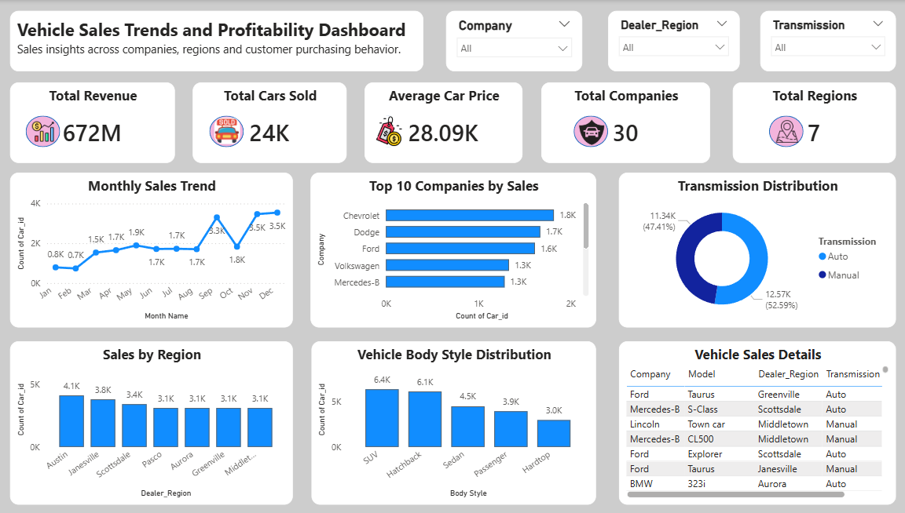
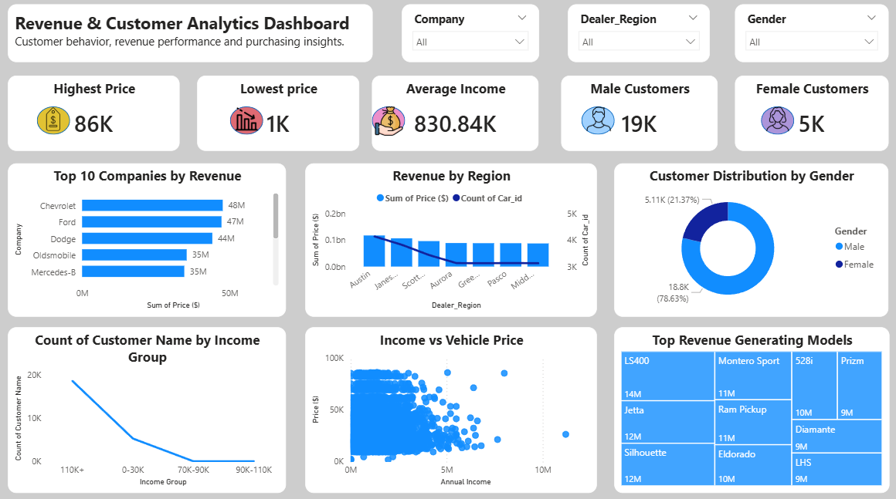

# 🚗 Vehicle Sales Trends and Profitability Analysis

## 📌 Project Overview

This project analyzes vehicle sales data to uncover trends in revenue, customer purchasing behavior, regional performance, and vehicle preferences. The goal is to transform raw sales data into actionable business insights through data cleaning, exploratory data analysis, SQL querying, and interactive Power BI dashboards.

This is an end-to-end Data Analytics project built using Python, SQL, and Power BI.

---

## 🎯 Project Objectives

- Analyze vehicle sales performance across different companies and regions.
- Identify top-performing vehicle brands and models.
- Understand customer demographics and purchasing behavior.
- Examine the relationship between customer income and vehicle price.
- Create interactive dashboards for business decision-making.

---

## 🛠️ Tools & Technologies Used

- Python
  - Pandas
  - NumPy
  - Matplotlib
- SQL
- Power BI
- Microsoft Excel / CSV Dataset
- GitHub

---

## 📂 Dataset Information

The dataset contains vehicle sales transaction records with information such as:

- Car ID
- Date
- Customer Name
- Gender
- Annual Income
- Dealer Name
- Company
- Model
- Engine
- Transmission
- Color
- Price
- Body Style
- Dealer Region

**Total Records:** 23,906

---

## 🔍 Data Cleaning & Preprocessing

Performed the following data preparation steps:

- Checked dataset dimensions and data types
- Handled missing values
- Verified duplicate records
- Converted date fields
- Created Year, Month, Quarter, and Month Name columns
- Performed data validation and consistency checks

---

## 📊 Exploratory Data Analysis (EDA)

Key analyses performed:

- Total Revenue Analysis
- Average Vehicle Price Analysis
- Monthly Sales Trend Analysis
- Company-wise Sales Performance
- Region-wise Sales Analysis
- Transmission Distribution Analysis
- Vehicle Body Style Analysis
- Customer Income Analysis
- Gender Distribution Analysis

---

## 🗄️ SQL Analysis

Business questions answered using SQL:

- Top-selling vehicle companies
- Revenue by region
- Average vehicle price by company
- Most popular vehicle models
- Transmission preference analysis
- Customer demographic insights

---

## 📈 Power BI Dashboard

### Page 1: Vehicle Sales Trends and Profitability Dashboard

#### KPIs
- Total Revenue
- Total Cars Sold
- Average Car Price
- Total Companies
- Total Regions

#### Visualizations
- Monthly Sales Trend
- Top 10 Companies by Sales
- Transmission Distribution
- Sales by Region
- Vehicle Body Style Distribution
- Vehicle Sales Details Table

---

### Page 2: Revenue & Customer Analytics Dashboard

#### KPIs
- Highest Vehicle Price
- Lowest Vehicle Price
- Average Customer Income
- Male Customers
- Female Customers

#### Visualizations
- Top 10 Companies by Revenue
- Revenue by Region
- Customer Distribution by Gender
- Customer Distribution by Income Group
- Income vs Vehicle Price Analysis
- Top Revenue Generating Models

---

## 💡 Key Insights

- Chevrolet generated the highest overall revenue.
- Ford and Dodge were among the top-performing vehicle brands.
- Austin was one of the highest-performing dealer regions.
- Automatic transmission vehicles were slightly more popular than manual vehicles.
- SUVs and Hatchbacks were among the most preferred body styles.
- Male customers represented the majority of vehicle purchases.
- Higher-income customers generally purchased higher-priced vehicles.
- A small number of vehicle models generated a significant share of total revenue.

---

## 📷 Dashboard Screenshots

#### Vehicle Sales Trends and Profitability Dashboard



#### Revenue & Customer Analytics Dashboard


---

## 📌 Project Outcome

This project demonstrates the complete Data Analytics workflow:

**Raw Data → Data Cleaning → EDA → SQL Analysis → Dashboard Development → Business Insights**

The final dashboards provide decision-makers with valuable insights into vehicle sales performance, customer behavior, and profitability trends.

---

## 📁 Project Structure

```text
Vehicle-Sales-Trends-and-Profitability-Analysis
│
├── Dataset
│   └── car_sales.csv
│
├── Python
│   └── Vehicle_Sales_Analysis.ipynb
│
├── SQL
│   └── vehicle_sales_queries.sql
│
├── PowerBI
│   └── Vehicle_Sales_Dashboard.pbix
│
├── Dashboard Images
│   ├── page1.png
│   └── page2.png
│
└── README.md
```

---

## 👨‍💻 Author

**Chirag Bharwad**

Aspiring Data Analyst

### Skills
- Python
- SQL
- Power BI
- Excel
- Data Visualization
- Exploratory Data Analysis

---

⭐ If you found this project useful, feel free to star the repository.
